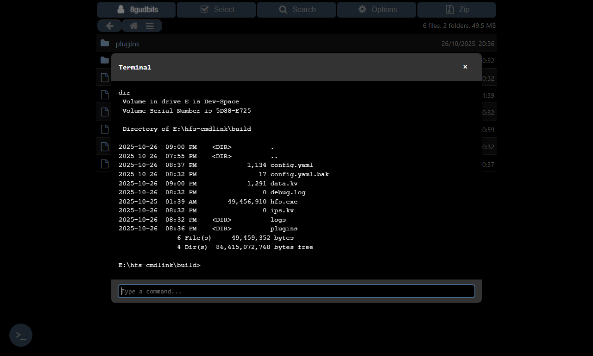

# hfs-cmdlink

Execute commands on the server from the frontend.

## Features

- Execute server commands via web interface
- User/group-based access control (no access unless explicitly configured)

## Manual Installation

1. Download the plugin's `dist` folder and rename it to `cmdlink`
2. Place it in your HFS `plugins` directory
3. Refresh HFS admin page

## Configuration

In the plugin settings, specify which users/groups can access the terminal:

- **Allowed Users**: Select specific users or groups who can use the terminal
- **Leave empty**: No one can access the terminal (default)

## Security Note

This plugin allows executing arbitrary commands on your server with the same permissions as the HFS process. Use with caution and only grant access to trusted users.

## Development

To contribute to this plugin:

1. Fork the repository
2. Make your changes
3. Submit a pull request

## Screenshot

## Changelog

### v1.2

- Added persistent shell sessions and improved terminal behavior

### v1.1

- Added backend permission verification

### v1.0

- Initial release
- Command execution functionality

